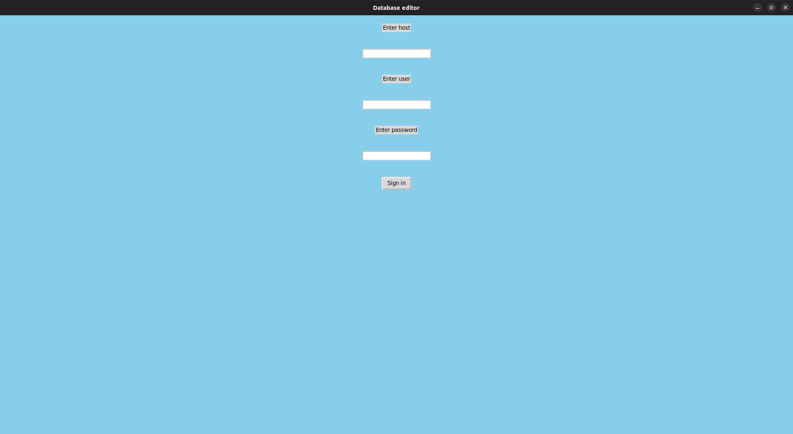
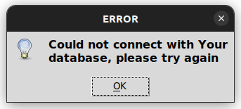
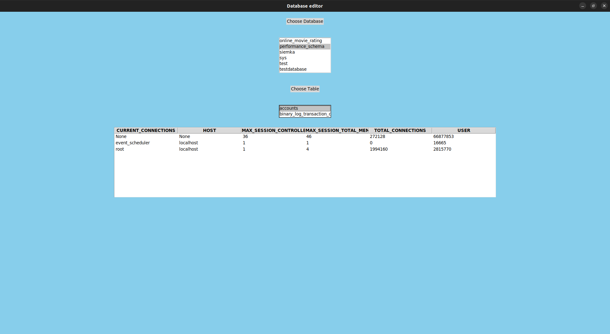

# Tkinter app for sql database displaying and manipulation

## Functionalities

* ### Loading and displaying database
* ### Editing elements
* ### Deleting elements

## Progress

-[x] Login screen

-[x] Database choice

-[x] Table choice 

-[ ] Table element edition

-[ ] Table element removal

-[ ] Button for returning to login screen

-[ ] Simple options panel

## Screenshots of working app

### Login screen

### Login error info

### Database screen

